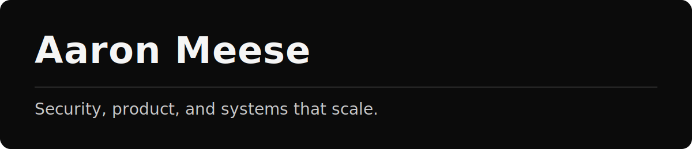

  <picture>
    
  </picture>

  <picture>
    
  </picture>

  <a href="https://link.aaronmeese.com/linkedin">LinkedIn</a> ·
  <a href="https://link.aaronmeese.com/medium">Blog</a> ·
  <a href="mailto:aaron@meese.dev">Email</a>

  

**Now** 
Building security-forward platforms and tooling that remove operational friction.

**Stack** 
Docker · Kubernetes · Node.js · Python · Go · Rust

**Reading** 
<!-- READING-LOG:START -->
- [Caught in the Hook: RCE and API Token Exfiltration Through Claude Code Project Files](https://research.checkpoint.com/2026/rce-and-api-token-exfiltration-through-claude-code-project-files-cve-2025-59536/)
- [What I learned building an opinionated and minimal coding agent](https://mariozechner.at/posts/2025-11-30-pi-coding-agent/)
- [The Engine Behind the Hype](https://www.onuruzunismail.com/blog/the-engine-behind-the-hype)
- [You no longer need JavaScript](https://lyra.horse/blog/2025/08/you-dont-need-js/)
- [The Self-Improving AI System That Built Itself](https://x.com/agent_wrapper/status/2025986105485733945)
<!-- READING-LOG:END -->
<a href="https://reading.aaronmeese.com" target="_blank">More →</a>
