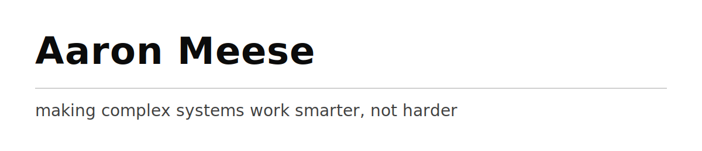

  <picture>
    <source media="(prefers-color-scheme: dark)" srcset="assets/hero.svg" />
    
  </picture>

  <picture>
    <source media="(prefers-color-scheme: dark)" srcset="https://ajmeese7-git-master-aaron-meeses-projects.vercel.app/api/divider?theme=dark&duration=6" />
    
  </picture>

  <a href="https://link.aaronmeese.com/linkedin" target="_blank">LinkedIn</a> ·
  <a href="https://link.aaronmeese.com/medium" target="_blank">Medium</a> ·
  <a href="https://meese.rs" target="_blank">Blog</a> ·
  <a href="mailto:aaron@meese.dev">Email</a>

  <a href="https://open.spotify.com/user/ajmeese">
    <picture>
      <source media="(prefers-color-scheme: dark)" srcset="https://ajmeese7-git-master-aaron-meeses-projects.vercel.app/api/spotify?theme=dark&speed=0.7&grad=0.1" />
      
    </picture>
  </a>

**Now** 
Building security-forward platforms and tooling that remove operational friction.

**Stack** 
Docker · Kubernetes · Node.js · Python · Go · Rust

**Reading** 
<!-- READING-LOG:START -->
- [ADD / XOR / ROL: RL economics, morally charged terms, and "distillation"](https://addxorrol.blogspot.com/2026/06/rl-economics-morally-charged-terms-and.html)
- [Using the Needs Stack for competitive strategy](https://longform.asmartbear.com/needs-stack)
- [Hacking Google with A.I. for $500,000](https://brutecat.com/articles/hacking-google-with-ai/)
- [never waste a token](https://sunilpai.dev/posts/never-waste-a-token/)
- [How SpaceX Became Embedded in America’s War Machine](https://thecurrency.news/articles/229517/how-spacex-became-embedded-in-americas-war-machine/)
<!-- READING-LOG:END -->
<a href="https://reading.aaronmeese.com" target="_blank">More →</a>

**Latest posts** 
<!-- BLOG-POSTS:START -->
- [Feed your AI agent your Medium writing](https://meese.rs/posts/medium-rss-for-agent-context/)
- [An ant is too small to have one drag coefficient](https://meese.rs/posts/an-ant-is-too-small-for-one-drag-coefficient/)
- [How much wind does it take to blow an ant off a wall?](https://meese.rs/posts/wind-to-move-an-ant/)
<!-- BLOG-POSTS:END -->
<a href="https://meese.rs" target="_blank">More →</a>
