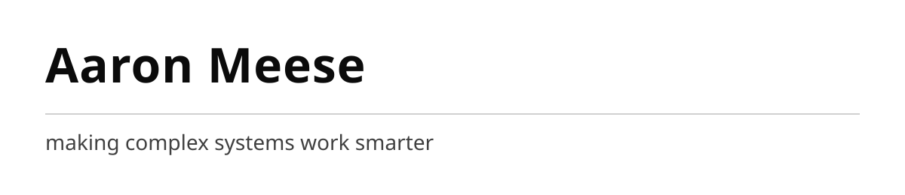

  <picture>
    <source media="(prefers-color-scheme: dark)" srcset="assets/hero.svg" />
    
  </picture>

  <picture>
    <source media="(prefers-color-scheme: dark)" srcset="https://ajmeese7-git-master-aaron-meeses-projects.vercel.app/api/divider?theme=dark&duration=6" />
    
  </picture>

  <a href="https://link.aaronmeese.com/linkedin" target="_blank">LinkedIn</a> ·
  <!-- <a href="https://link.aaronmeese.com/medium" target="_blank">Medium</a> · -->
  <a href="https://meese.rs" target="_blank">Blog</a> ·
  <a href="mailto:aaron@meese.dev">Email</a>

<!--

  <a href="https://open.spotify.com/user/ajmeese">
    <picture>
      <source media="(prefers-color-scheme: dark)" srcset="https://ajmeese7-git-master-aaron-meeses-projects.vercel.app/api/spotify?theme=dark&speed=0.7&grad=0.1" />
      
    </picture>
  </a>

-->

**Now** 
Improving agentic observability and implementing deterministic safeguards.

**Stack** 
Docker · Kubernetes · Node.js · Python · Go · Rust

**Reading** 
<!-- READING-LOG:START -->
- [Hackers Got Inside a Flock Camera. Its Data Shows How the System Really Works](https://www.wired.com/story/hackers-flock-camera-data-shows-how-system-works/)
- [I Came, I Prompted, I Left Part 2: Building a GPU Driver From Scratch in One Mon…](https://codyho.dev/blog/gpu-driver/)
- [The 8 habits of great conversationalists](https://www.fastcompany.com/91604120/the-8-habits-of-great-conversationalists)
- [More Money Than They Ever Imagined—and No Clue How to Spend It](https://www.wsj.com/tech/ai/ai-tech-anthropic-openai-ipo-0a9da59e)
- [How to protect yourself from workslop](https://www.seangoedecke.com/how-to-protect-yourself-from-workslop/)
<!-- READING-LOG:END -->
<a href="https://reading.aaronmeese.com" target="_blank">More →</a>

**Latest posts** 
<!-- BLOG-POSTS:START -->
- [On writing with AI](https://meese.rs/posts/on-writing-with-ai/)
- [Fable at low effort is my daily driver now, not Opus at high](https://meese.rs/posts/fable-low-over-opus-high/)
- [Nobody gives away RSS-to-email](https://meese.rs/posts/nobody-gives-away-rss-to-email/)
- [Analytics for readers who block analytics](https://meese.rs/posts/analytics-for-readers-who-block-analytics/)
- [Trying to automate data-broker removals with Hermes](https://meese.rs/posts/automating-data-broker-removals-with-unbroker/)
<!-- BLOG-POSTS:END -->
<a href="https://meese.rs" target="_blank">More →</a>
